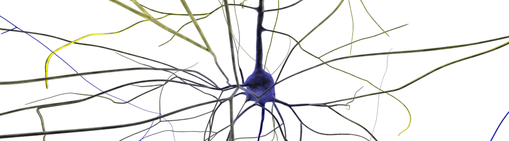

# RTNeuron

Welcome to RTNeuron, the scalable real-time rendering tool for the
visualization of neuronal simulations based on cable models.

The main utility of RTNeuron is twofold: the interactive visual inspection of
structural and functional features of the cortical column model and the
generation of high quality movies and images for presentation and publications.
This guide will get you acquaintanced with all the features provided by
RTNeuron and how to fully exploit them for both purposes.

RTNeuron provides a C++ library with an OpenGL-based rendering backend, a
Python wrapping and an Python application called *rtneuron*.  This
documentation mostly covers the use of the command line application and the
Python wrapping. To use RTNeuron as a C++ library, developers are referred to
the C++ class reference.

RTNeuron is only supported in GNU/Linux systems. However, it should also be
possible to build it in Windows systems. For OS/X it may be quite challenging
and require changes in OpenGL related code to get it working.

## Documentation

The full user documentation of RTNeuron can be found [here](http://bluebrain.github.io/RTNeuron-3.0/index.html). Some useful direct links are:
- [Compilation instructions](http://bluebrain.github.io/RTNeuron-3.0/compilation.html)
- [Basic user guide](http://bluebrain.github.io/RTNeuron-3.0/user_guide.html)
- [Python module reference](http://bluebrain.github.io/RTNeuron-3.0/python/index.html)
- [Code examples and image gallery](http://bluebrain.github.io/RTNeuron-3.0/python/gallery.html)
- [Release_notes](http://bluebrain.github.io/RTNeuron-3.0/release_notes.html)

## Known Bugs

Please file a [Bug Report](https://github.com/BlueBrain/RTNeuron/issues) if you
find new issues which have not already been reported in
[Bug Report](https://github.com/BlueBrain/RTNeuron/issues) page. If you find an
already reported problem, please update the corresponding issue with your inputs
and outputs.

## About

RTNeuron has been jointly developed by the EPFL Blue Brain Project and the
Universidad Politécnica de Madrid. Main financial support was provided by the
ETH Board funding to the Blue Brain Project and Cajal Blue Brain (funded by
the Spanish Ministerio de Ciencia, Innovación y Universidades). Partial
funding has been furthermore provided by the European Union’s Horizon 2020
research and innovation programme under grant agreement no.720270. (HBP SGA1).
