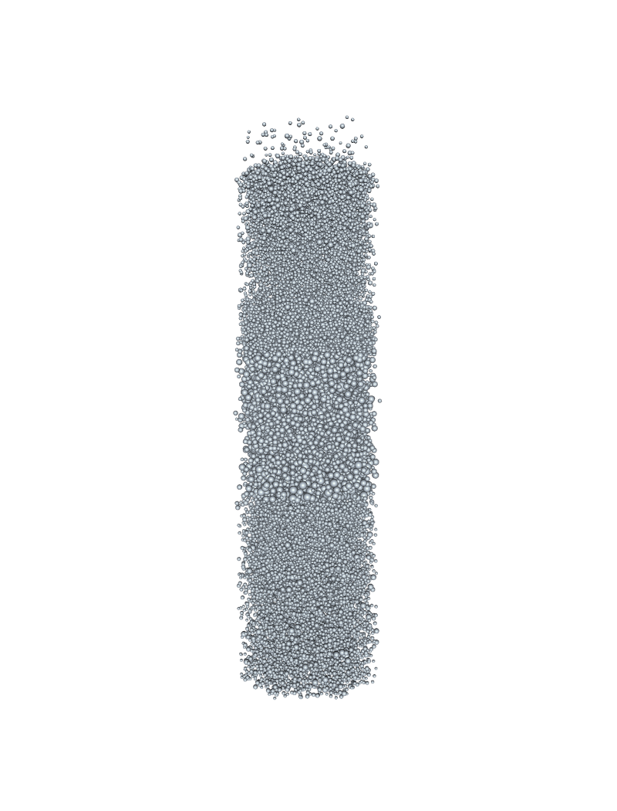
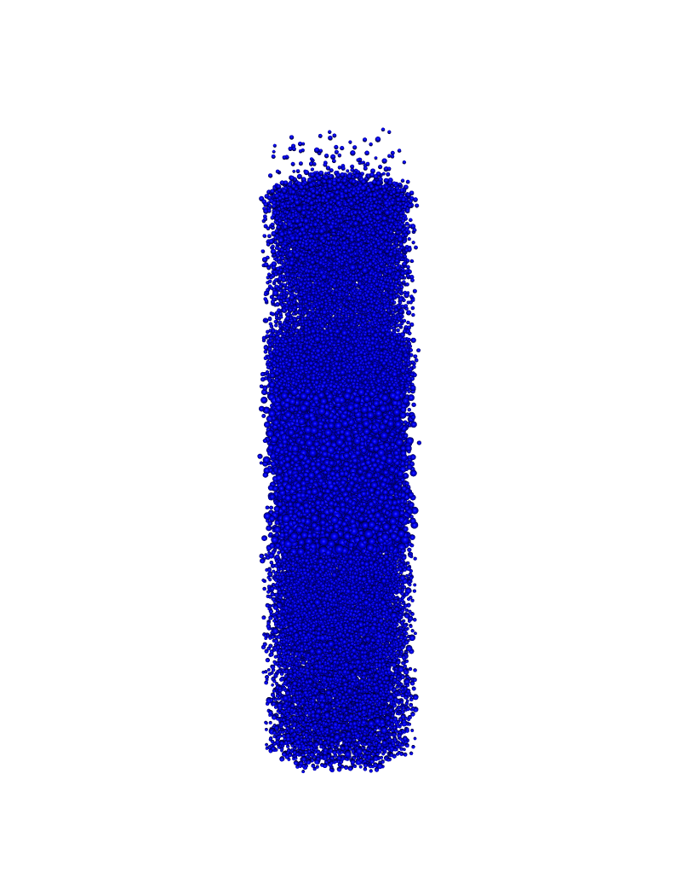
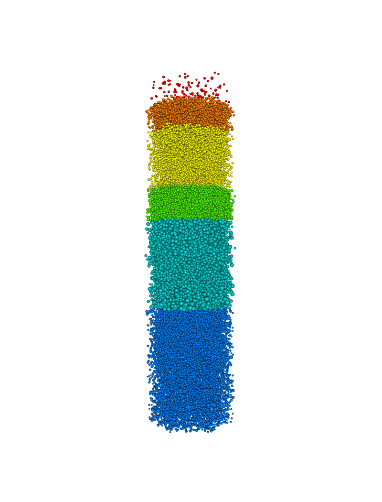
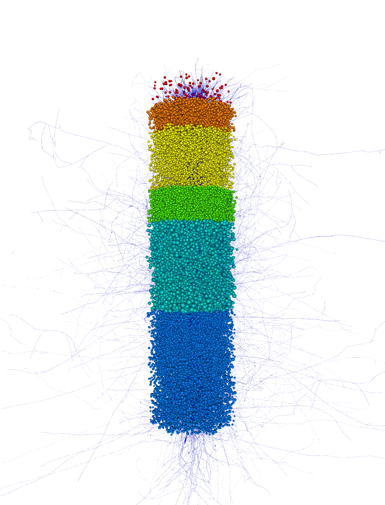
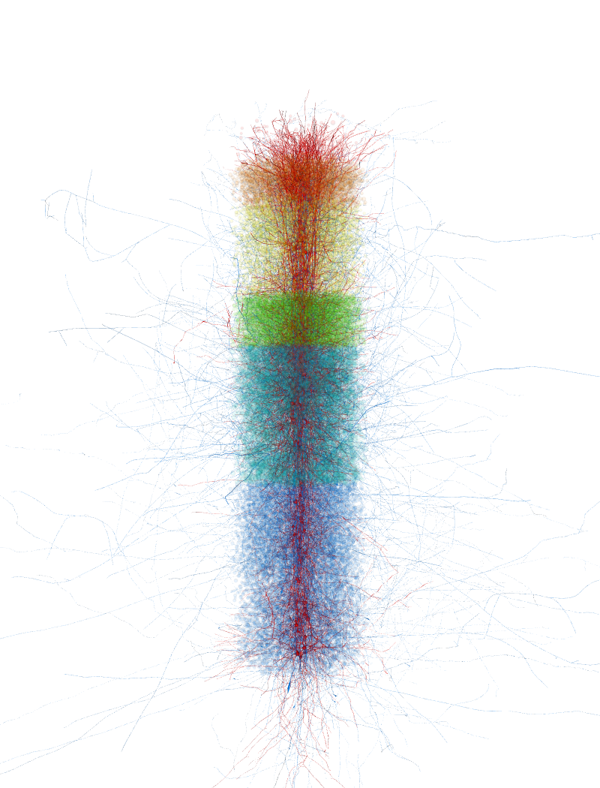
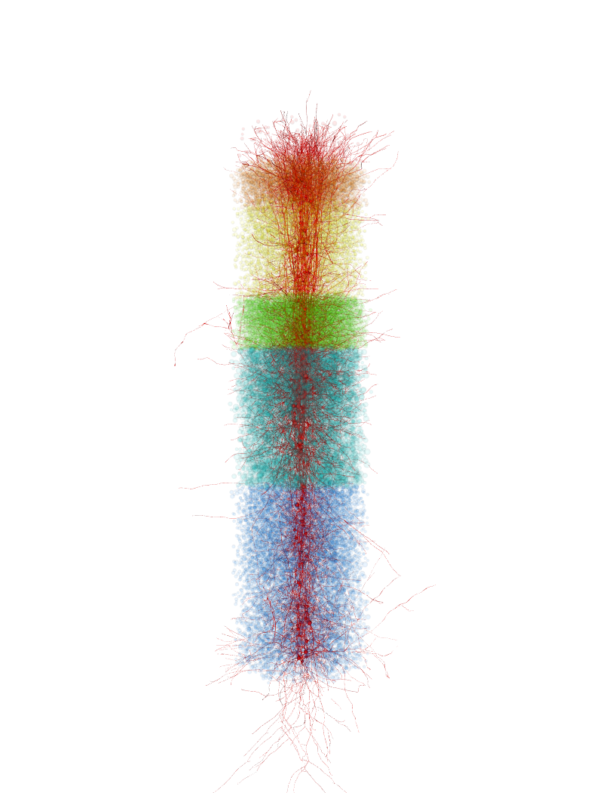

.. _colorings_and_modes:

Colorings and modes
-------------------

The most immediate thing that can be done with the rtneuron module is to
display one test circuit. By default, only the somata are displayed,
using spheres to represent them, but this can be changed by provinding each
target as a tuple of the target key and the attribute dict.

.. code:: python

    import os
    import rtneuron

    # Presetting the global variables for the default window size
    rtneuron.global_attributes.window_width = 800
    rtneuron.global_attributes.window_height = 1100
    if 'EQ_WINDOW_IATTR_HINT_FULLSCREEN' in os.environ:
        del os.environ['EQ_WINDOW_IATTR_HINT_FULLSCREEN']
        
    # By default, morphologies are loaded even in soma only mode to find out the soma radius.
    # This can be disabled by uncommenting the line below.
    # rtneuron.default_scene_attributes.load_morphologies = False
    
    #blueconfig = "/gpfs/bbp.cscs.ch/release/l2/2012.07.23/circuit/O1/merged_circuit/CircuitConfig"
    blueconfig = "/gpfs/bbp.cscs.ch/project/proj3/resources/circuits/ReleaseL2_fixed"
    rtneuron.display_circuit(blueconfig, ('mc2_Column', {"mode": rtneuron.RepresentationMode.SOMA}))
    view = rtneuron.engine.views[0]
    view.attributes.background = [1, 1, 1, 1]
    scene = view.scene
    simulation = rtneuron.simulation
    rtneuron.snapshot_to_notebook(view)

::

    Trying to load blue config: /home/hernando/bbp/data/blue.cfg... done
    Creating 10000 neurons
    0%   10   20   30   40   50   60   70   80   90   100%
    |----|----|----|----|----|----|----|----|----|----|
    ***************************************************
    Adding 10000 neurons to the scene
    0%   10   20   30   40   50   60   70   80   90   100%
    |----|----|----|----|----|----|----|----|----|----|
    ***************************************************

Using the handler object that represents all the neurons added to the
scene we can, for example, change the color of the neurons. This
property is accessed through the *attributes* member of the handler.

.. code:: python

    all_neurons = scene.objects[0]
    all_neurons.attributes.color = [0, 0, 1, 1]
    all_neurons.update()
    rtneuron.snapshot_to_notebook(view)

Now we will obtain the list of cell IDs of each layer. Each layer has a
*target* name associated with it. There are *targets* also for other
circuit subsets. The targets for layers are queried from the simulation.
The ids are used to query subsets of the scene object that represents
the whole circuit. Each query returns a handler that can be used to
modify the attributes of the subset it represents. The list of ids of
each query may overlap. In this case, the properties of the last handler
applied prevail.

In this case we are going to change the color of each layer.

.. code:: python

    layer_ids =[]
    for i in range(1, 7):
        layer_ids.append(simulation.gids('Layer%d' % i))

    layers = [all_neurons.query(ids) for ids in layer_ids]
    colors = [[1, 0, 0, 1], [1, 0.5, 0, 1], [1, 1, 0, 1],
              [0.3, 1.0, 0, 1], [0, 0.8, 0.8, 1], [0, 0.5, 1, 1]]
    for layer, color in zip(layers, colors):
        layer.attributes.color = color
        layer.update()
    rtneuron.snapshot_to_notebook(view)

It is possible to modify the representation of neurons dynamically, for
example to show the full morphology of selected neurons. Data will be
loaded on demand as needed.

.. code:: python

    ids = simulation.gids('mc2_MiniColumn_0')
    minicolumn = all_neurons.query(ids)
    minicolumn.attributes.mode = rtneuron.RepresentationMode.WHOLE_NEURON
    minicolumn.update()
    rtneuron.snapshot_to_notebook(view)

After enabling transparency on the scene we can modify the alpha channel
of the colors to make the neurons outside our target of interest less
visible.

.. code:: python

    rtneuron.sceneops.enable_transparency(scene)
    for layer in layers:
        c = layer.attributes.color
        # layer.attributes.color[3] = 0.2 won't work as expected. Without getting
        # into too many details, AttributeMap is special in the sense that attributes.color
        # creates a temporary variable, so to change the color you have to reset it.
        c[3] = 0.05
        layer.attributes.color = c
        layer.update()
    # The layers overlap with minicolumn, so it becomes dirty. Calling update resets
    # its attributes.
    minicolumn.update()
    rtneuron.snapshot_to_notebook(view)

.. image:: colorings_and_modes_files/colorings_and_modes_9_0.png

We can also display axon and dendrites with different colors or display
only the dendrites of specific cells.

.. code:: python

    minicolumn.attributes.color = [1, 0, 0, 1]
    minicolumn.attributes.secondary_color = [0, 0.5, 1, 1]
    minicolumn.attributes.color_scheme = rtneuron.ColorScheme.BY_BRANCH_TYPE
    minicolumn.update()
    rtneuron.snapshot_to_notebook(view)

.. code:: python

    minicolumn.attributes.mode = rtneuron.RepresentationMode.NO_AXON
    minicolumn.update()
    rtneuron.snapshot_to_notebook(view)

Another option is to color the branches according to the value of some
property. The currently supported modes are coloring by distance to soma
and by branch width.

.. code:: python

    import math
    colormap = rtneuron.ColorMap()
    # The following colormap is a non linear function that mimics light attenuation based on an absortion
    # coefficient. The final images are not phisically correct because the attenuation is visualized as
    # if branches were perpendicular to light rays, but gives a good result.
    absortion_coeff = 20
    points = dict()
    max_width = 80
    for i in range(50):
        width = max_width * i / 49.0
        alpha = 1 - math.exp(-width * 1/absortion_coeff)
        points[width] = [alpha * 0.5, alpha, 1, alpha]
    colormap.setPoints(points)

    minicolumn.attributes.colormaps = rtneuron.AttributeMap()
    minicolumn.attributes.colormaps.by_width = colormap
    minicolumn.attributes.color_scheme = rtneuron.ColorScheme.BY_WIDTH
    minicolumn.update()
    rtneuron.snapshot_to_notebook(view)

.. image:: colorings_and_modes_files/colorings_and_modes_14_0.png

