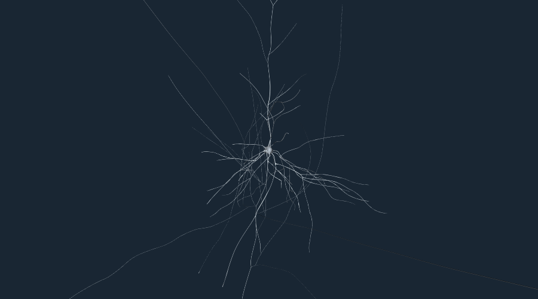
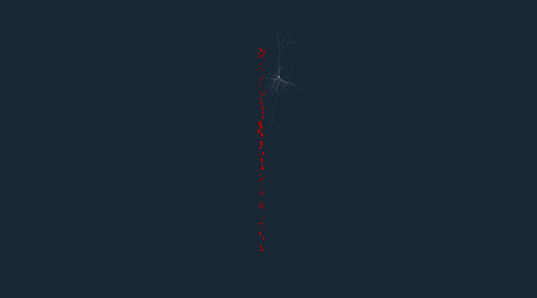
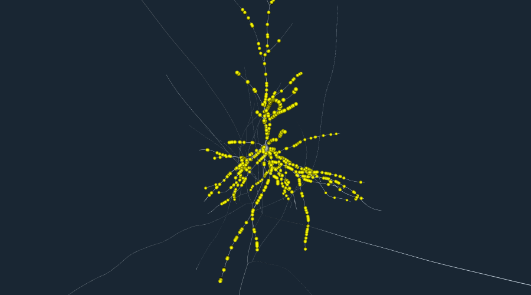
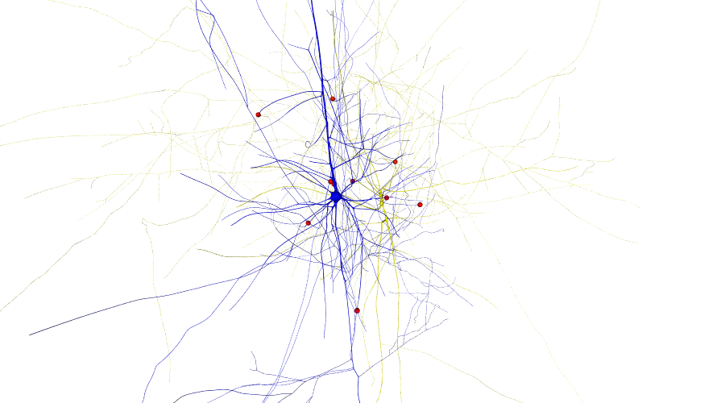
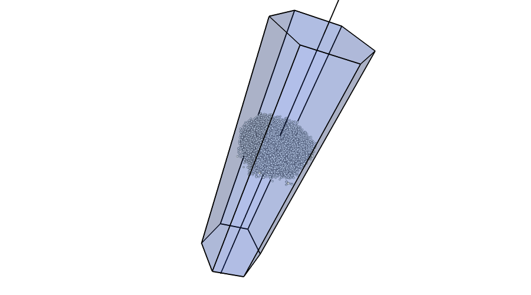

.. _getting_started:

Getting started
===============

We start by importing the rtneuron Python module. When ``rtneuron``
is started with no arguments it launches an IPython shell whose
namespace is the namespace of the rtneuron module, so there is no need
to import it (this is in a way similar to from rtneuron import \*, but
not exactly the same).

.. code:: python

    import rtneuron
    
    # The following code is used to reduce the size of the output images from the default one.
    rtneuron.global_attributes.window_width = 900
    rtneuron.global_attributes.window_height = 500
    import os
    if 'EQ_WINDOW_IATTR_HINT_FULLSCREEN' in os.environ:
        del os.environ['EQ_WINDOW_IATTR_HINT_FULLSCREEN']

As a quick start you can use |display_circuit| to show a list of cell sets.
This will create an RTNeuron engine object, initialize the rendering
context and populate the scene with the given targets

.. code:: python

    blueconfig = "/gpfs/bbp.cscs.ch/project/proj3/resources/circuits/ReleaseL2_fixed"
    rtneuron.display_circuit(blueconfig, 6523)

::

    Trying to load blue config: /gpfs/bbp.cscs.ch/project/proj3/resources/circuits/ReleaseL2_fixed... done
    Creating 1 neurons
    0%   10   20   30   40   50   60   70   80   90   100%
    |----|----|----|----|----|----|----|----|----|----|
    ***************************************************
    Adding 1 neurons to the scene
    0%   10   20   30   40   50   60   70   80   90   100%
    |----|----|----|----|----|----|----|----|----|----|
    ***************************************************

The function |snapshot_to_notebook| is provided to directly embed snapshots into
a IPython notebook. This function takes a view as its argument. Another way of
getting snapshot is using the |view_snapshot| function, which takes as an
argument the file path of the ouput image.

.. code:: python

    rtneuron.snapshot_to_notebook(rtneuron.engine.views[0])

.. code:: python

    rtneuron.display_circuit(blueconfig,
                             [6523, # First target of a target list
                              ('MiniColumn_0', {'mode': rtneuron.RepresentationMode.SOMA,
                                                'color': [1, 0, 0, 1]}) # Second one, with attributes
                             ])
    rtneuron.snapshot_to_notebook(rtneuron.engine.views[0])

::

    Trying to load blue config: /gpfs/bbp.cscs.ch/project/proj3/resources/circuits/ReleaseL2_fixed... done
    Creating 1 neurons
    0%   10   20   30   40   50   60   70   80   90   100%
    |----|----|----|----|----|----|----|----|----|----|
    ***************************************************
    Adding 1 neurons to the scene
    0%   10   20   30   40   50   60   70   80   90   100%
    |----|----|----|----|----|----|----|----|----|----|
    ***************************************************
    Creating 100 neurons
    0%   10   20   30   40   50   60   70   80   90   100%
    |----|----|----|----|----|----|----|----|----|----|
    ***************************************************
    Adding 100 neurons to the scene
    0%   10   20   30   40   50   60   70   80   90   100%
    |----|----|----|----|----|----|----|----|----|----|
    ***************************************************

Once a scene is created it is possible to add synapses to it. The
following code adds all the afferent synapses of a neuron to the scene.

.. code:: python

    rtneuron.display_circuit(blueconfig, 6523)
    # This function doesn't directly accept a dictionary for the attributes, it has to be
    # an AttributeMap instead.
    rtneuron.display_synapses(
        6523, attributes=rtneuron.AttributeMap({'color': [1, 1, 0, 1], 'radius': 3}))
    rtneuron.snapshot_to_notebook(rtneuron.engine.views[0])

::

    Trying to load blue config: /gpfs/bbp.cscs.ch/project/proj3/resources/circuits/ReleaseL2_fixed... done
    Creating 1 neurons
    0%   10   20   30   40   50   60   70   80   90   100%
    |----|----|----|----|----|----|----|----|----|----|
    ***************************************************
    Adding 1 neurons to the scene
    0%   10   20   30   40   50   60   70   80   90   100%
    |----|----|----|----|----|----|----|----|----|----|
    ***************************************************

A typical use case is to show the synapses shared by two or more cells.

.. code:: python

    pre = 77403
    post = 78389
    rtneuron.display_circuit(blueconfig, [(pre, {'color': [1, 1, 0, 1]}), # presynaptic
                                          (post, {'color': [0, 0, 1, 1]})]) # postsynaptic
    rtneuron.display_shared_synapses(pre, post,
                                     attributes=rtneuron.AttributeMap({'color': [1, 0, 0, 1], 'radius': 4}))
    view = rtneuron.engine.views[0]
    view.attributes.background = [1, 1, 1, 1]
    rtneuron.snapshot_to_notebook(view)

::

    Trying to load blue config: /gpfs/bbp.cscs.ch/project/proj3/resources/circuits/ReleaseL2_fixed... done
    Creating 1 neurons
    0%   10   20   30   40   50   60   70   80   90   100%
    |----|----|----|----|----|----|----|----|----|----|
    ***************************************************
    Adding 1 neurons to the scene
    0%   10   20   30   40   50   60   70   80   90   100%
    |----|----|----|----|----|----|----|----|----|----|
    ***************************************************
    Creating 1 neurons
    0%   10   20   30   40   50   60   70   80   90   100%
    |----|----|----|----|----|----|----|----|----|----|
    ***************************************************
    Adding 1 neurons to the scene
    0%   10   20   30   40   50   60   70   80   90   100%
    |----|----|----|----|----|----|----|----|----|----|
    ***************************************************

When a simulation is loaded from the command line or the
:py:func:`rtneuron.display_circuit` function is called several global objects
become available at the rtneuron module (or the shell is running inside the
IPython console launched by ``rtneuron``:
 * ``engine``: The |RTNeuron| instance
 * ``simulation``: The ``brain.Simulation`` object with the blue config loaded.

Apart from the helper methods showed so far, a scene can also be
populated manually starting from an empty scene. The functions to do so
are:
 * |addNeurons|
 * |addAfferentSynapses| and |addEfferentSynapses|
 * |addModel| and |addGeometry|

These methods handle to the scene object created. The handle can be used
to modify some properties of the scene objects or to remove then from
the scene.

.. code:: python

    import brain
    import numpy
    
    view = rtneuron.display_empty_scene()
    scene = view.scene
    
    blueconfig = "/gpfs/bbp.cscs.ch/project/proj3/resources/circuits/ReleaseL2_fixed"
    # Opening a simulation and assigning the circuit to the scene
    simulation = brain.Simulation(blueconfig)
    scene.circuit = simulation.open_circuit()
    target = numpy.intersect1d(simulation.gids('mc2_Column'),
                               simulation.gids('Layer4'))
    attributes = rtneuron.AttributeMap()
    attributes.mode = rtneuron.RepresentationMode.SOMA
    handler = scene.addNeurons(target, attributes)
.. code:: python

    # We can add a vertical line through the centroid of the target displayed
    circuit = scene.circuit
    positions = circuit.positions(circuit.gids('mc2_Column'))
    center = positions.mean(axis=0)
    bottom = [center[0], -500, center[2]]
    top = [center[0], 2500, center[2]]
    scene.addGeometry([top, bottom], [[0, 1]], attributes = rtneuron.AttributeMap({'mode': 'lines', 'line_width': 2}))
    
    # A helper function can be used to add a hexagonal prism to the scene.
    rtneuron.add_hexagonal_prism(scene, [center[0], 0, center[2]], 2000, 270)
    # In order to see the interior we have to enable transparency
    rtneuron.sceneops.enable_transparency(scene)
.. code:: python

    view = rtneuron.engine.views[0]
    view.attributes.background = [1, 1, 1, 1]
    view.camera.setView([-1055, 2410, 990], ([-0.5969, -0.7982, -0.080], 76.79247283935547))
    rtneuron.snapshot_to_notebook(view)

The doxygen documentation of all objects from the ``rtneuron`` module is
available as regular docstrings (these include also the wrapping
documentation generated by Boost.Python automatically). If IPython is
found tab-completion will work in the shell.

Some objects provide an attribute based API exposed by an object
property called ``attributes``, this object is and instance of
``AttributeMap``. In Python this object appears as an object in which
attributes of arbitrary names can be added to the instance. The
attribute value types are limited to ``int``, ``str``, ``double``,
``bool`` and lists of those. ``AttributeMap's`` can be nested but a list
attribute cannot contain another attribute map. Some attribute maps can
provide documentation about its attributes using the ``help()``
function. This works for example for the ``View`` object.

.. code:: python

    view.attributes.help()

::

    AttributeMap instance documentation:
    
    Attribute map with runtime configurable attributes for a View.
    
    Existing attributes are:
     General:
       *background* (floatx4): Background color. The alpha channel of the background is considered by frame grabbing functions. If alpha equals to 1, the output images will have no alpha channel.
    
       *use_roi* (float): Compute and use regions of interest for frame readback in parallel rendering configurations.
    
     Appearance:
       *clod_threshold* (float): When using continuous LOD, the unbiased distance at which the transition from pseudocylinders to tublets occurs for branches of radius 1. This value is modulated by the lod_bias. During rendering, the distance of a segment is divided by its radius before comparing it to the clod_threshold.
    
       *colormaps* (AttributeMap): A map of ColorMap objects. The currently supported color maps are:
         *compartments*: The color map to use for compartmental simulation data.
    
         *spikes*: The color map to use for spike rendering. This range of this color map must be always [0, 1], otherwise the rendering results are undefined.
    
       *display_simulation* (bool): Show/hide simulation data.
    
       *idle_AA_steps* (int): Number of frames to accumulate in idle anti-aliasing
    
       *highlight_color* (floatx4): The color applied to make highlighted neurons stand out. The highlight color replaces the base color when *display_simulation* is disabled. When *display_simulation* is enabled, the highlight color is added to the color obtained from simulation data mapping.
    
       *inflation_factor* (float): Sets the offset in microns by which neuron membrane surfaces will be displaced along their normal direction. This parameter has effect only on those scenes whose *inflatable_neurons* attribute is set to true.
    
       *lod_bias* (float): A number between 0 and 1 that specifies the bias in LOD selection. 0 goes for the lowest LOD and 1 for the highest.
    
       *probe_color* (floatx4): The color to apply to those parts of a neuron whose simulation value is above the threshold if simulation display is enabled.
    
       *probe_threshold* (float): The simulation value above which the probe color will be applied to neuron surfaces if simulation display is enabled.
    
       *spike_tail* (float): Time in millisecond during which the visual representation of spikes will be still visible.
    
     Frame capture
       *snapshot_at_idle* (bool): If true, take snapshots only when the rendering thread becomes idle (e.g. antialias accumulation done). Otherwise, the snapshot is taken at the very next frame.
    
       *output_file_prefix* (string): Prefix for file written during recording.
    
       *output_file_format* (string): File format extension (without dot) to use during frame recording. Supported extensions are those for which OSG can find a pluging.
    
     Cameras and stereo
       *auto_compute_home_position* (bool): If true, the camera manipulator home position is recomputed automatically when the scene object is changed or when the scene emits its dirty signal.
    
       *auto_adjust_model_scale* (bool): If true, every time the scene is changed the ratio between world and model scales is adjusted.
    
       *model_scale* (bool) : Size hint used by Equalizer to setup orthographic projections and stereo projections. Set to 1 in order to use world coordinates in orthographic camera frustums.
    
       *stereo_correction* (float): Multiplier of the scene size in relation to the observer for stereo adjustment.
    
       *stereo* (bool) : Enables/disables stereoscopic rendering.
    
       *zero_parallax_distance* (float): In stereo rendering, the distance from the camera in meters at which left and right eye projections converge into the same image (only meaningful for fixed position screens). All valid attributes are initialized to their default values. 

.. |display_circuit| replace:: :py:func:`display_circuit<rtneuron.display_circuit>`
.. |snapshot_to_notebook| replace:: :py:func:`snapshot_to_notebook<rtneuron.snapshot_to_notebook>`
.. |view_snapshot| replace:: :py:func:`snapshot<rtneuron._rtneuron.View.snapshot>`
.. |RTNeuron| replace:: :py:class:`RTNeuron<rtneuron._rtneuron.RTNeuron>`
.. |addNeurons| replace:: :py:func:`addNeurons<rtneuron._rtneuron.Scene.addNeurons>`
.. |addAfferentSynapses| replace:: :py:func:`addAfferentSynapses<rtneuron._rtneuron.Scene.addAfferentSynapses>`
.. |addEfferentSynapses| replace:: :py:func:`addEfferentSynapses<rtneuron._rtneuron.Scene.addEfferentSynapses>`
.. |addModel| replace:: :py:func:`addModel<rtneuron._rtneuron.Scene.addModel>`
.. |addGeometry| replace:: :py:func:`addGeometry<rtneuron._rtneuron.Scene.addGeometry>`
