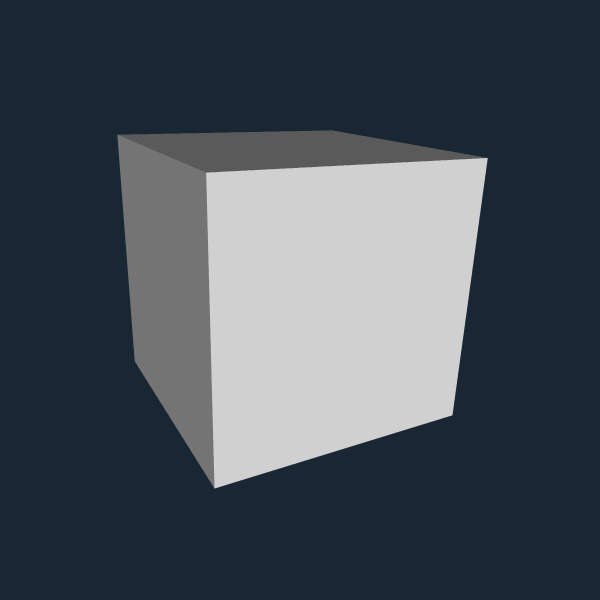
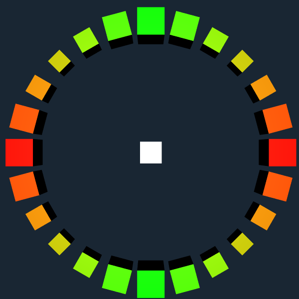
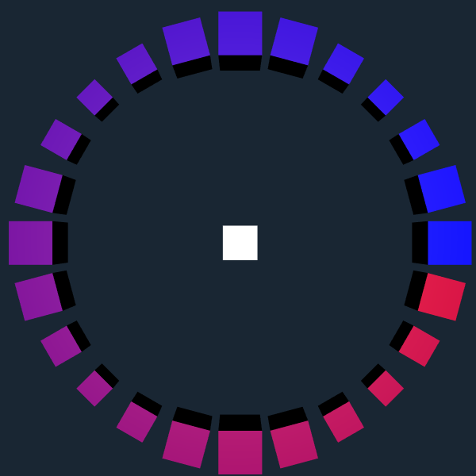
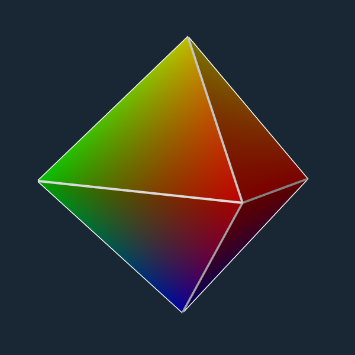
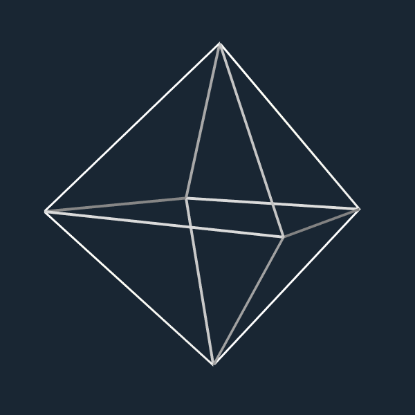

.. _meshes_and_models:

Meshes and models
-----------------

This notebook shows how to add objects to a scene which are not part of a
circuit, in particular, polygonal meshes created by the user with Python code
and models from files.

Let's start showing how to load a model from a file into the scene using
|addModel|.

.. code:: python

    import rtneuron
    import os

    # Presetting the global variables for the default window size
    rtneuron.global_attributes.window_width = 600
    rtneuron.global_attributes.window_height = 600
    if 'EQ_WINDOW_IATTR_HINT_FULLSCREEN' in os.environ:
        del os.environ['EQ_WINDOW_IATTR_HINT_FULLSCREEN']

    # We start by creating an engine instance with an empty scene
    rtneuron.display_empty_scene()
    view = rtneuron.engine.views[0]
          scene = view.scene

.. code:: python

    # The following code creates a temporary .obj file with a cube.
    # It will be deleted once the kernel is shutdown.
    import tempfile
    modelfile = tempfile.NamedTemporaryFile(suffix=".obj")
    modelfile.write("""\
    v -100.0 -100.0 -100.0\nv -100.0 -100.0 100.0\nv -100.0 100.0 -100.0\nv -100.0 100.0 100.0
    v 100.0 -100.0 -100.0\nv 100.0 -100.0 100.0\nv 100.0 100.0 -100.0\nv 100.0 100.0 100.0
    vn 0.0 0.0 1.0\nvn 0.0 0.0 -1.0\nvn 0.0 1.0 0.0\nvn 0.0 -1.0 0.0\nvn 1.0 0.0 0.0\nvn -1.0 0.0 0.0
    f 1//2 7//2 5//2\nf 1//2 3//2 7//2\nf 1//6 4//6 3//6\nf 1//6 2//6 4//6\nf 3//3 8//3 7//3\nf 3//3 4//3 8//3
    f 5//5 7//5 8//5\nf 5//5 8//5 6//5\nf 1//4 5//4 6//4\nf 1//4 6//4 2//4\nf 2//1 6//1 8//1\nf 2//1 8//1 4//1
    """.encode("utf-8"))
    modelfile.flush()

    scene.addModel(modelfile.name)
    view.camera.setView([-210, 150, 400], ([-0.58413, -0.80526, -0.10175], 35.531))
    rtneuron.snapshot_to_notebook(view)

The load function has two optional parameters to set a transformation and
provide an AttributeMap with extra options. The only valid extra option at the
moment is an overall color for the model. This color is only guaranteed to be
applied if the model file doesn't provide materials or per vertex colors.

.. code:: python

    import math
    for i in range(24):
        angle = math.radians(15 * i)
        p = [600 * math.cos(angle), 600 * math.sin(angle), 0]
        s = 1 + math.cos(angle * 4) * 0.25

        # Here we only show the version of addModel that takes a string as argument.
        # The transform string can encode a sequence of ':' separated transformations
        # from local to world coordinates. The leftmost transformation is applied first
        # See the reference for the second version of addModel that takes a
        # transformation matrix.
        transform = ("s@%f,%f,%f:" % (s, s, s) + # scale sx,sy,sx
                     "r@0,0,1,%f:" % (15.0 * i) + # rotate x,y,z,angle
                     "t@%f,%f,%f:" % (p[0], p[1], p[2])) # and translate tx,ty,tz
        attributes = rtneuron.AttributeMap()
        attributes.color = [abs(math.cos(angle)), abs(math.sin(angle)), 0, 1]
        scene.addModel(modelfile.name, transform, attributes=attributes)

    view.camera.setView([-15, 26, 2850], ([0.0, 0.0, 1.0], 0.0))
    rtneuron.snapshot_to_notebook(view)

.. code:: python

    # The color of a given model can also be changed after it has been added to the scene
    for i in range(24):
        # Getting the handler to the next cube in the outer circle
        o = scene.objects[i + 1]
        # And changing the color
        o.attributes.color = [i / 30.0, 0, 1 - i / 30.0, 1]
        o.update()

    view.camera.setView([-15, 26, 2850], ([0.0, 0.0, 1.0], 0.0))
    rtneuron.snapshot_to_notebook(view)

The file formats supported are those for which OpenSceneGraph has
plugins, in particular obj, ply, stl and vrml are well supported. Note
that adding a model multiple times to a scene creates a full instance of
the model each time. Instancing of a single model multiple times is not
supported by the API and there are no plans to do so at the moment.

The function to add a polygonal mesh to the scene is |addGeometry|. This
function cannot take an extra parameter with a transformation. With
addGeometry it's possible to add triangular meshes and lines sets.

.. code:: python

    # Clear the scene first
    scene.clear()

    # Creating an octahedron
    l = 200
    h = math.sqrt(2) * l/2
    vertices = [[0, h, 0], [-l/2, 0, -l/2], [l/2, 0, -l/2], [l/2, 0, l/2], [-l/2, 0, l/2], [0, -h, 0]]
    indices = [[0, 1, 2], [0, 2, 3], [0, 3, 4], [0, 4, 1], [5, 2, 1], [5, 3, 2], [5, 4, 3], [5, 1, 4]]
    colors = [[1, 1, 0, 1], [0, 1, 0, 1], [0, 1, 0, 1], [1, 0, 0, 1], [1, 0, 0, 1.0], [0, 0, 1, 1]]
    # We are not going to provide per vertex normals, instead we are going to request flat shading.
    # With flat shading, the model has per facet normals which are computed on-the-fly during rendering.
    attributes = rtneuron.AttributeMap()
    attributes.flat = True
    scene.addGeometry(vertices, indices, colors=colors, attributes=attributes)

    # Now we will add another mesh to paint the edges of the model.
    indices = [[0, 1], [0, 2], [0, 3], [0, 4], [1, 2], [2, 3], [3, 4], [4, 1], [1, 5], [2, 5], [3, 5], [4, 5]]
    # Colors don't need to be specified by vertex, a single color can also be provided, or no
    # color at all, which then defaults to white. For lines, the line width can be set using the
    # attributes map for extra parameters. Per vertex normals are ignored in line primitives, lines are lit
    # according to their relative position to the screen.
    attributes = rtneuron.AttributeMap()
    attributes.line_width = 4
    import numpy
    scene.addGeometry(numpy.array(vertices), numpy.array(indices), colors=[1, 1, 1, 1], attributes=attributes)
    # As can be seen addGeometry also accepts numpy arrays.

    view.camera.setView([-313, 37, 180], ([-0.0943, -0.995, -0.0327], 59))
    rtneuron.snapshot_to_notebook(view)

.. code:: python

    scene.remove(scene.objects[0])
    view.camera.setView([-313, 37, 180], ([-0.0943, -0.995, -0.0327], 59))
    rtneuron.snapshot_to_notebook(view)

.. |addGeometry| replace:: :py:func:`addGeometry<rtneuron._rtneuron.Scene.addGeometry>`
.. |addModel| replace:: :py:func:`addModel<rtneuron._rtneuron.Scene.addModel>`
