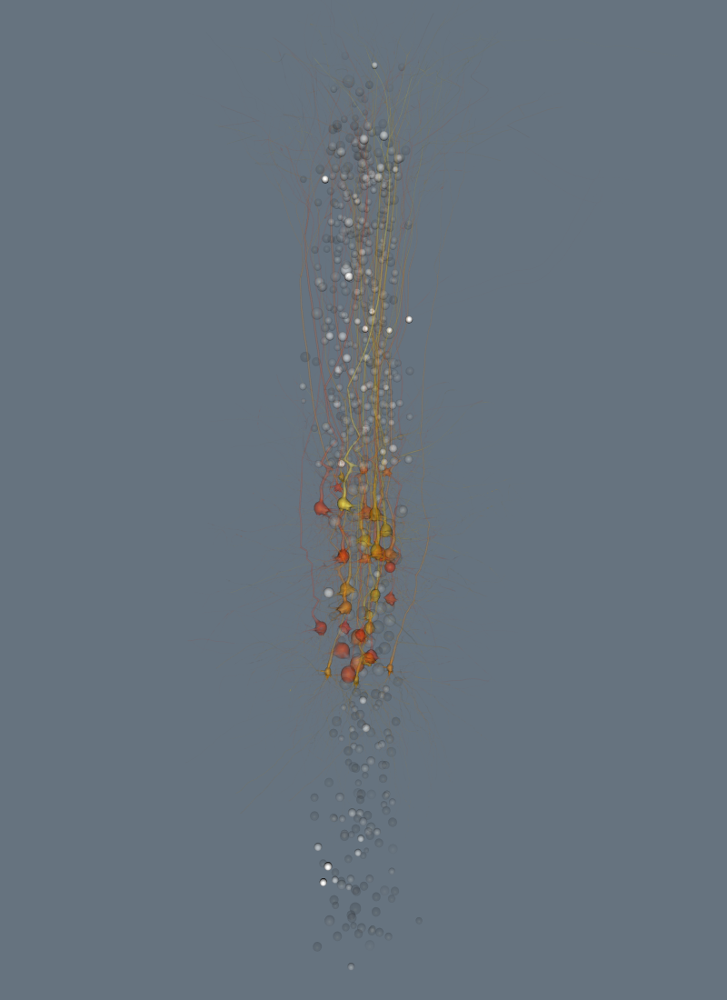

.. _simulation_playback:

Simulation playback
-------------------

We start displaying the 600 center cells of the circuit. Notice that
``display_circuit`` accepts regular expressions.

.. code:: python

    import rtneuron
    import brain
    
    # Presetting the global variables for the default window size
    rtneuron.global_attributes.window_width = 800
    rtneuron.global_attributes.window_height = 1100
    
    # Creating the attributes for the neuron set that will be displayed
    attributes = rtneuron.AttributeMap()
    attributes.mode = rtneuron.RepresentationMode.SOMA
    # Displaying the circuit
    rtneuron.display_circuit(brain.test.blue_config, ('MiniColumn_[0-5]', attributes))
    
    view = rtneuron.engine.views[0]
    view.attributes.background = [0.4, 0.45, 0.5, 1.0]
    view.camera.setView([60, 760, 1760], ([0.0, 0.0, 1.0], 0.0))
    # Make sure the camera is not modified after scene modifications.
    view.attributes.auto_compute_home_position = False
    
    scene = view.scene

::

    Trying to load blue config: /home/hernando/dev/Debug/BBPTestData/local/simulations/may17_2011/Control/BlueConfig... done
    Creating 600 neurons
    0%   10   20   30   40   50   60   70   80   90   100%
    |----|----|----|----|----|----|----|----|----|----|
    ***************************************************
    Adding 600 neurons to the scene
    0%   10   20   30   40   50   60   70   80   90   100%
    |----|----|----|----|----|----|----|----|----|----|
    ***************************************************

There are two types of simulation data:

* Spike time traces, where each spike is a discrete event defined by a
  timestamp and a cell identifier.
* Reports of continuous scalar variables on the neuron membrane measured, aka
  compartment reports. These data are reported for a discretization of the
  morphological skeleton where each piece is called a compartment.

At somas it's possible to visualize them as a color shift that is
triggered at the spike time and decays gradually to the color used for
the inactive state. To apply spike data on the scene there's a helper
function that simplifies the process.

.. code:: python

    # The input parameters can also be a file with spike times (.gdf or BBP .out) and a scene.
    # When a scene is used, simulation display has to be enabled explicitly on the view.
    rtneuron.apply_spike_data(rtneuron.simulation, view)
    player = rtneuron.engine.player
    player.timestamp = 8
    rtneuron.snapshot_to_notebook(view)

It's possible to assign a different colormap to different neuron
subsets. This allows, for example, to use different colors to highlight
spikes of excitatory and inhibitory neurons.

.. code:: python

    all_neurons = scene.objects[0]
    
    def apply_spike_colormap_to_cells(set_name, color):
        colormap = rtneuron.ColorMap()
        colormap.setPoints({0: [0, 0, 0, 0], 1: color})
        subset = all_neurons.query(rtneuron.simulation.gids(set_name))
        # Colormaps are assigned into a nested AttributeMap called 'colormaps'.
        # This attribute is not defined by default, we have to create it.
        subset.attributes.colormaps = rtneuron.AttributeMap()
        # The colormap for spike data is called 'spikes'
        subset.attributes.colormaps.spikes = colormap
        subset.update()
        return subset
        
    excitatory = apply_spike_colormap_to_cells('Excitatory', [1, 0, 0, 1])
    inhibitory = apply_spike_colormap_to_cells('Inhibitory', [0, 0.5, 1, 1])
    
    rtneuron.sceneops.enable_transparency(scene)
    rtneuron.snapshot_to_notebook(view)

.. image:: simulation_playback_files/simulation_playback_5_0.png

Simulation playback can be controlled from the *engine.player* object.

.. code:: python

    player.timestamp = player.window[0]
    view.attributes.spike_tail = 10
    player.simulationDelta = 0.5
    player.play()
Another helper functions simplifies the process of applying a
compartment report to the scene. For somas, if both spike and
compartment data have been applied, compartment data takes precedence.

.. code:: python

    player.pause()
    rtneuron.apply_compartment_report(rtneuron.simulation, view, 'voltage')
    player.timestamp = 7.6
    rtneuron.snapshot_to_notebook(view)

At any moment we can change the representation mode of some neurons to
use detailed morphologies. We will do it for the center minicolumn.

.. code:: python

    minicolumn = all_neurons.query(rtneuron.simulation.gids('L5CSPC'))
    minicolumn.attributes.mode = rtneuron.RepresentationMode.WHOLE_NEURON
    minicolumn.update()
    # When spike data has been provided, the axon shows the propagation of the action potentials using a
    # constant (hardcoded) speed. Since the spike fall-off time (spike_tail view attribute) was modified
    # before, we set here a more reasonable value.
    view.attributes.spike_tail = 1
    player.timestamp = 10
    rtneuron.snapshot_to_notebook(view)

.. image:: simulation_playback_files/simulation_playback_11_0.png

Colormaps for compartment data can also be applied on a circuit subset
basis. The following code takes the default colormap and converts it to
a black & white colormap for the soma only neurons

.. code:: python

    def to_grayscale(color, alpha_factor):
        v = 0.21 * color[0] + 0.72 * color[1] + 0.07 * color[2]
        return (v, v, v, color[3] * alpha_factor)
        
    global_colormap = view.attributes.colormaps.compartments
    
    original = rtneuron.ColorMap()
    original.setPoints(global_colormap.getPoints())
    
    points = {value: to_grayscale(color, 0.3)
              for value, color in original.getPoints().items()}
    
    global_colormap.setPoints(points)
    
    minicolumn.attributes.colormaps = rtneuron.AttributeMap()
    minicolumn.attributes.colormaps.compartments = original
    minicolumn.update()
    rtneuron.snapshot_to_notebook(view)

.. image:: simulation_playback_files/simulation_playback_13_0.png

The alpha channel of the colors can be modulated by the static coloring
scheme. At the moment the only possible modification is its
multiplication by the alpha channel defined by the static coloring.

.. code:: python

    import math
    
    minicolumn.attributes.color_scheme = rtneuron.ColorScheme.BY_WIDTH
    colormap = rtneuron.ColorMap()
    # The actual colors aren't important is the alpha channel what matters
    def width(i):
        return 80 * i / 49.0
    points = {width(i): [1, 1, 1, 1 - math.exp(-width(i) * 1/10.0)] for i in range(50)}
    colormap.setPoints(points)
    minicolumn.attributes.mode = rtneuron.RepresentationMode.NO_AXON
    minicolumn.attributes.colormaps.by_width = colormap
    minicolumn.update()
    player.timestamp = 6
    rtneuron.snapshot_to_notebook(view)

.. code:: python

    player.timestamp = player.window[0]
    player.play()
.. code:: python

    player.pause()
