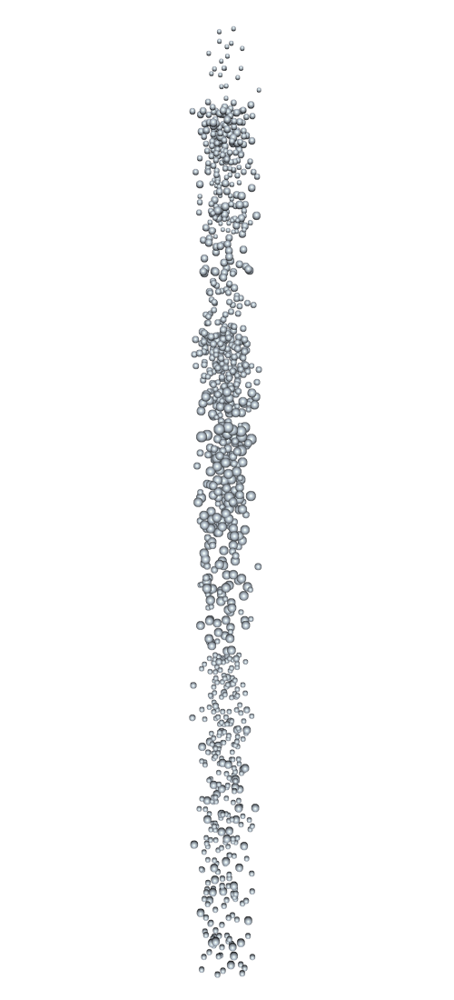
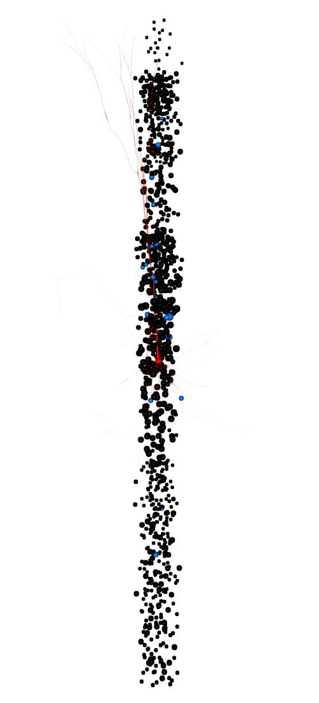
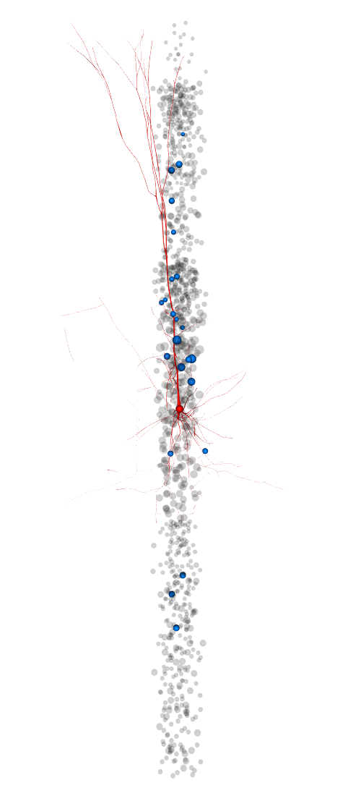
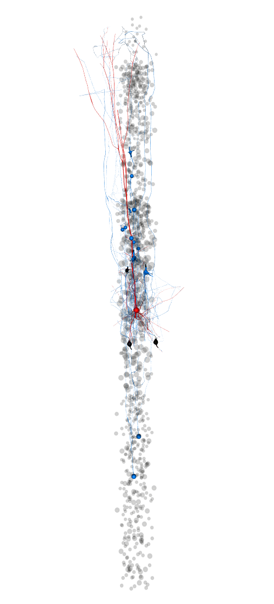
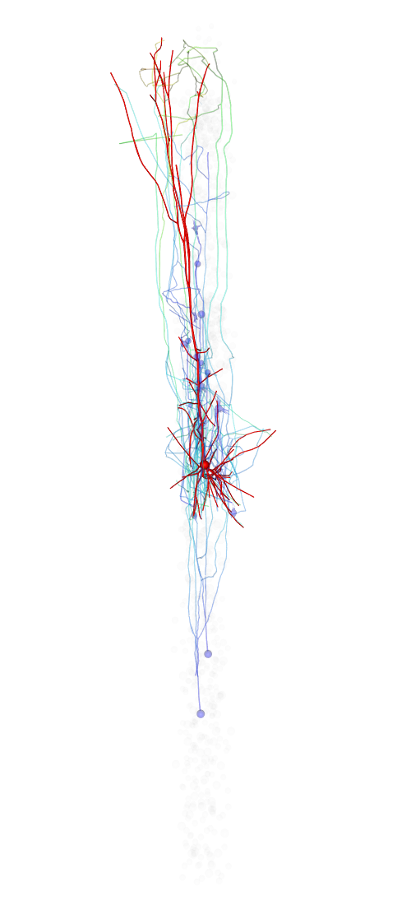

.. _synaptic_afferent_projections:

Synaptic afferent projections
-----------------------------

We start dispaying the circuit for a full column in soma only mode.

.. code:: python

    import os
    import rtneuron
    import brain

    # Presetting the global variables for the default window size
    rtneuron.global_attributes.window_width = 500
    rtneuron.global_attributes.window_height = 1100
    if 'EQ_WINDOW_IATTR_HINT_FULLSCREEN' in os.environ:
        del os.environ['EQ_WINDOW_IATTR_HINT_FULLSCREEN']
    
    # Creating the attributes for the neuron set that will be displayed
    attributes = rtneuron.AttributeMap()
    attributes.mode = rtneuron.RepresentationMode.SOMA
    # Displaying the circuit
    rtneuron.display_circuit(brain.test.circuit_config, ('MiniColumn_[0-9]', attributes))
    
    view = rtneuron.engine.views[0]
    view.attributes.background = [1, 1, 1, 1]
    view.camera.setView([40, 1000, 2185], ([0.0, 0.0, 1.0], 0.0))
    # Make sure the camera is not modified after scene modifications.
    view.attributes.auto_compute_home_position = False
    
    scene = view.scene
    rtneuron.snapshot_to_notebook(view)

::

    Trying to load blue config: /home/hernando/bbp/data/blue.cfg... done
    Creating 10000 neurons
    0%   10   20   30   40   50   60   70   80   90   100%
    |----|----|----|----|----|----|----|----|----|----|
    ***************************************************
    Adding 10000 neurons to the scene
    0%   10   20   30   40   50   60   70   80   90   100%
    |----|----|----|----|----|----|----|----|----|----|
    ***************************************************

Now we pick an arbitrary presynaptic cell and find its set of
postsynaptic cells. For this purpose we use the class
rtneuron.sceneops.SynapticProjections, which implements several
algorithms to find out projections between cells.

.. code:: python

    projections = rtneuron.sceneops.SynapticProjections(scene,
                                                        target_mode = rtneuron.RepresentationMode.SOMA)
    projections.show_retrograde_projections(607)
    rtneuron.snapshot_to_notebook(view)

To make the connected cells stand out from the rest we are going to
enable transparency on the scene. By default SynapticProjections assigns
a color with some transparency to non participating cells.

.. code:: python

    rtneuron.sceneops.enable_transparency(scene)
    rtneuron.snapshot_to_notebook(view)

In this visualization the presynpatic cells are rendered in blue and in
soma only mode, while the postsynaptic cell is rendered in red with its
full morphology. It's also possible to render presynaptic cells with
their full morphologies, but in this case, there's the option of culling
the branches of the cells to show only the paths that connect the
presynatic somas to the postsynaptic soma. Actually this is the default
operation mode of SynpaticProjection, so we will create a new one using
the default parameters.

.. code:: python

    projections = rtneuron.sceneops.SynapticProjections(scene)
    projections.show_retrograde_projections(607)
    rtneuron.snapshot_to_notebook(view)

Finally we will change some of the visual attributes of the presynaptic
and posynaptic neurons to emphasize the dendritic tree and the
disitribution of axonal processes.

.. code:: python

    # Make the context cells less visible
    projections.set_unselected_color([0.5, 0.5, 0.5, 0.01])
    # And make the post and presynaptic cells thicker.
    scene.attributes.inflatable_neurons = True
    view.attributes.inflation_factor = 1

The representation of presynaptic cells can be modified so that the
color of the axon is a function of the distance to the soma postsynaptic
soma.

.. code:: python

    attributes = rtneuron.AttributeMap()
    attributes.color_scheme = rtneuron.ColorScheme.BY_DISTANCE_TO_SOMA
    attributes.colormaps = rtneuron.AttributeMap()
    colormap = rtneuron.ColorMap()
    colormap.setPoints({0: [0.0, 0.0, 1.0, 0.2], 500: [0.0, 1.0, 1.0, 0.2],
                        1000: [0, 1.0, 0, 0.2], 1500: [1.0, 1.0, 0, 0.2], 2000: [1.0, 0.0, 1.0, 0.2]})
    attributes.colormaps.by_distance_to_soma = colormap
    projections.set_presynaptic_attributes(attributes)
    rtneuron.snapshot_to_notebook(view)

.. code:: python

    by_distance = rtneuron.ColorMap()
    by_distance.setPoints({0: [0.0, 0.0, 1.0, 0.2], 500: [0.0, 1.0, 1.0, 0.2],
                           1000: [0, 1.0, 0, 0.2], 1500: [1.0, 1.0, 0, 0.2], 2000: [1.0, 0.0, 1.0, 0.2]})
    view.attributes.inflation_factor = 2
    view.attributes.lod_bias = 0
    
    def color(x, alpha):
        c = list(by_distance.getColor(x))
        c[3] = alpha
        return c
    
    t = 51
    def advance():
        global t
        colormap.setPoints({0: [0.0, 0.0, 1.0, 0.2], 1: [0.0, 0.0, 0.0, 0],
                            t - 50: color(t - 50, 0), t: color(t, 0.4), t + 50: color(t + 50, 0)})
        projections.set_presynaptic_attributes(attributes)
        t += 50
        if t > 2000:
            rtneuron.engine.frameIssued.disconnect(advance)
    
    rtneuron.engine.frameIssued.connect(advance)
    rtneuron.engine.frame()
